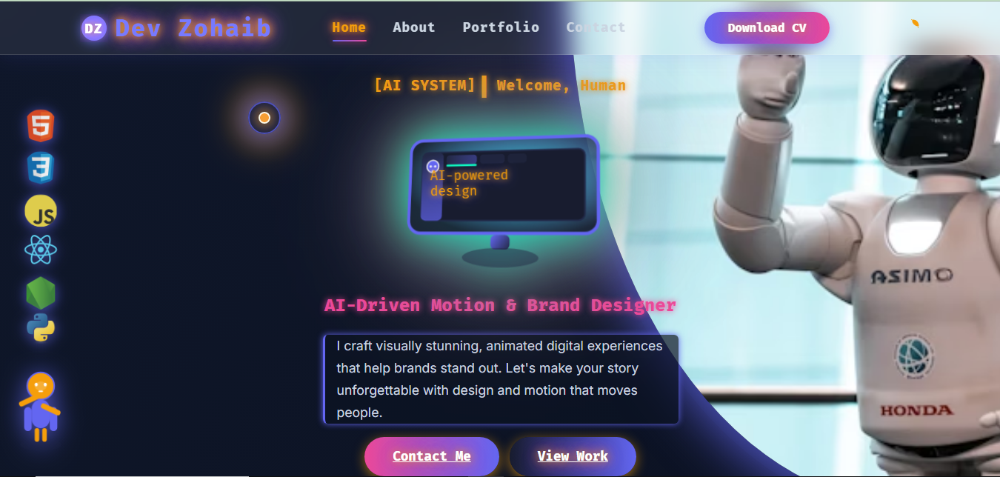

"# portfolio" 

# 💼 Creative Portfolio Website

A modern and interactive portfolio built using **HTML**, **CSS**, **JavaScript**, and **GSAP animations**, designed to showcase personal projects, skills, and creativity with beautiful **gradient color themes**.

---

## 📸 Screenshots


---

## 🌟 Features

- Smooth and powerful **GSAP animations**
- Modern **gradient-based color design**
- Fully **responsive layout**
- Clean, semantic **HTML5 structure**
- Interactive **JavaScript components**
- Fast-loading and lightweight

---

## 🛠️ Technologies Used

- HTML5
- CSS3 (Flexbox, Grid, Gradients)
- JavaScript (Vanilla JS)
- GSAP (GreenSock Animation Platform)

---

## 📂 Folder Structure

```bash
portfolio/
├── index.html
├── style.css
├── script.js
├── LICENSE
└── README.md
